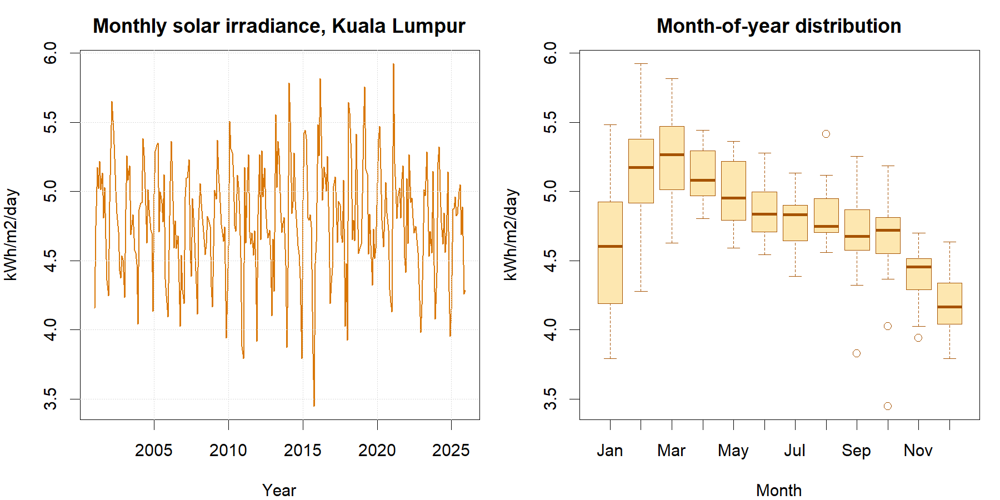

::: {custom-style="Author"}
[Member 1 name], [Member 2 name], [Member 3 name], and [Member 4 name]
:::

::: {custom-style="Affiliation"}
[Faculty name], [University name]  
BMMS2094 Statistics for Data Science · [Semester / session] · [Tutorial / group identifier]  
Submission date: [DD Month YYYY]
:::

```{=openxml}
<w:p>
  <w:pPr>
    <w:sectPr>
      <w:type w:val="continuous"/>
      <w:pgSz w:w="12240" w:h="15840"/>
      <w:pgMar w:top="1080" w:right="893" w:bottom="1440" w:left="893" w:header="720" w:footer="720" w:gutter="0"/>
      <w:cols w:num="1" w:space="720"/>
      <w:docGrid w:linePitch="360"/>
    </w:sectPr>
  </w:pPr>
</w:p>
```

::: {custom-style="Abstract"}
**Abstract—**This study compares SARIMA, Holt–Winters, ETS, and a basic structural time-series model for forecasting monthly NASA POWER surface solar irradiance in Kuala Lumpur. Models are evaluated on a common January 2021–December 2025 test period using accuracy, residual diagnostics, and physical-plausibility checks. SARIMA achieved the strongest admissible result, although its advantage over ETS and the structural model was modest.
:::

::: {custom-style="Keywords"}
**Keywords—**basic structural model, ETS, forecasting, Holt–Winters, NASA POWER, SARIMA, solar irradiance.
:::

# Introduction

Monthly solar-resource variability affects preliminary photovoltaic feasibility studies, storage sizing, maintenance scheduling, and energy-planning decisions. This study forecasts surface solar irradiance for Kuala Lumpur using NASA POWER's monthly `ALLSKY_SFC_SW_DWN` series at 3.139° N, 101.6869° E. NASA POWER supplies analysis-ready point time series and documents that its monthly solar fields combine satellite-derived archives rather than local ground-station measurements [@nasa-power-monthly]. The dataset contains 300 continuous observations from January 2001 through December 2025 in kWh/m²/day.

The objectives were to (1) audit and describe the monthly series; (2) fit and diagnose SARIMA, Holt–Winters, ETS, and a basic structural model; (3) compare the fitted models on a common 60-month chronological test using ME, MSE, RMSE, MAE, MPE, and MAPE; and (4) interpret the selected model for solar-resource planning. The work supports United Nations Sustainable Development Goal 7, *Affordable and Clean Energy*, particularly Target 7.2 on increasing renewable energy's share [@un-sdg7]. Irradiance is a resource indicator, however, and is not equivalent to photovoltaic electricity output.

# Methodology

The NASA JSON response would be parsed by year-month. Annual-summary keys such as `YYYY13` would be excluded, and `-999` would be treated as NASA's fill value. The cleaned series would be checked for the expected coverage, missing values, duplicate dates, chronological continuity, and implausible negative irradiance before being represented as a monthly time series with frequency 12.

An 80:20 chronological split would be used: January 2001–December 2020 for estimation and January 2021–December 2025 for evaluation. Random splitting would be avoided because it would leak future information into model development.

The training series would be examined using the original time-series plot, calendar-month distributions, monthly summaries, variance diagnostics, and differencing tests. Any need for a variance-stabilising transformation would be assessed from the training data by comparing transformed and untransformed diagnostics.

Four forecasting models would be evaluated. A manually specified SARIMA would represent serial dependence and recurring annual patterns, with its orders identified from training-only differencing and correlation diagnostics. Additive Holt–Winters without trend would represent level and additive seasonality without imposing a persistent trend. ETS would provide an innovations state-space approach in which the component forms and smoothing parameters could be estimated systematically. A basic structural model would be specified with a stochastic local level, a stochastic 12-month seasonal component, and irregular error, but no slope component, allowing gradual level movement without forcing a straight trend through the full record. Model-specific settings and estimated parameters would be reported in the individual reports. Together, the four models would compare seasonal correlation, smoothing, innovations state space, and structural state-space approaches [@hyndman-athanasopoulos-2021; @hyndman-khandakar-2008].

Response residuals (`observed − fitted`) would be used consistently [@forecast-residuals]. The common accuracy set would comprise ME, MSE, RMSE, MAE, MPE, and MAPE. ME and MPE would be judged by closeness to zero and their signs used to identify underforecasting or overforecasting; the other four measures would be minimised. Because MSE and RMSE induce the same ordering, they would not be treated as independent votes. Residual time plots, ACFs, and Ljung–Box tests at lag 24 would be evaluated with fitted degrees of freedom; $p>0.05$ would indicate insufficient evidence against residual white noise. The structural model's first 12 diffuse-initialisation months would be excluded from its in-sample residual check. Test RMSE would be the primary ranking metric and MAE secondary, subject to white-noise diagnostics and non-negative forecasts. The established models would be implemented reproducibly in R using `forecast`; the structural model would be estimated by maximum likelihood with Python `statsmodels` [@forecast-package; @r-core-2026; @seabold-perktold-2010].

# Data Analysis

The complete series averaged 4.7927 kWh/m²/day (SD 0.4061; range 3.4478–5.9244). Calendar-month means show a marked annual cycle: March was highest (5.2456), while December was lowest (4.2005). The original series fluctuates around a broadly stable long-run level, but shorter rises and falls mean that it should not be described as perfectly flat. The month-of-year distributions provide clearer evidence of recurring annual seasonality.

{width=3.20in}

| Model | Train RMSE | Test RMSE | Test MAE | Test MAPE | Test MSE | Test ME | Test MPE | Ljung-Box $Q(24)$ $p$ |
|---|---:|---:|---:|---:|---:|---:|---:|---:|
| SARIMA | 0.2743 | 0.2850 | 0.2198 | 4.6224 | 0.0812 | -0.0451 | -1.2191 | 0.1046 |
| ETS | 0.2758 | 0.2947 | 0.2351 | 4.9673 | 0.0869 | -0.0847 | -2.0546 | 0.0720 |
| BSM | 0.3029 | 0.2951 | 0.2370 | 5.0141 | 0.0871 | -0.0906 | -2.1818 | 0.0670 |
| HW | 0.3012 | 0.3101 | 0.2464 | 5.2213 | 0.0962 | -0.1037 | -2.4553 | 0.1491 |

*BSM: basic structural model; HW: Holt–Winters; MAPE and MPE are percentages. Only RMSE is shown for both training and test data; the other accuracy measures are test-set values.* On the common test period, the manually identified SARIMA had the lowest MSE, RMSE, MAE, and MAPE and the ME and MPE closest to zero. Negative ME and MPE for every model indicate average overforecasting under the declared `actual − forecast` convention. The train-test RMSE gap is a generalization diagnostic: a materially higher test RMSE may indicate overfitting, but the gap is not definitive proof because in-sample residual error and multi-step holdout forecast error are not directly equivalent. Model ranking therefore remains based primarily on test RMSE, subject to residual and physical-plausibility checks.

SARIMA ranked first and passed the diagnostic and physical-plausibility gates. Its RMSE was 0.0097 kWh/m²/day (3.30%) below ETS and 0.0101 kWh/m²/day (3.42%) below the structural model, so the advantage is useful but sample-specific. ETS was a statistically acceptable second. The structural model ranked third and narrowly passed the white-noise gate (Ljung–Box $p=0.0670$); all its test forecasts were non-negative. Holt–Winters also passed its white-noise test but produced the largest errors. The structural model's estimated seasonal variance was effectively zero, indicating that its seasonal pattern behaved as fixed after initialisation rather than evolving materially; this boundary estimate limits claims about changing seasonality.

The selected SARIMA model represents recurring annual patterns and serial dependence in the irradiance series. The analysis ends with the January 2021–December 2025 test forecasts because those 60 predictions can be compared directly with known actual values. Forecasting beyond December 2025 would not contribute to the requested accuracy assessment.

# Conclusion

SARIMA provided the strongest admissible result for this dataset: RMSE 0.2850, MAE 0.2198, and Ljung–Box $p=0.1046$. Its advantage over ETS and the basic structural model should be treated as a defensible selection for the present sample, not evidence of universal superiority. The graph and fitted structural model support annual seasonality around a slowly changing level, but they do not establish a sustained long-run increase or decrease.

Seasonal irradiance forecasts can inform early-stage renewable-resource assessment, maintenance timing, and storage planning aligned with SDG 7.2, but engineering decisions additionally require panel efficiency, temperature, shading, system losses, demand, and cost data. Further limitations include the gridded satellite product, monthly averaging, source-archive changes, absence of ground-station validation, structural-change risk, and uncertainty over the five-year horizon. Recommended extensions are local validation, rolling-origin evaluation, additional weather predictors, forecast combinations, and scheduled re-estimation as new observations arrive.

::: {custom-style="Heading 5"}
Author Contributions
:::

[Member 1 name] ([ID]): [25%]

[Member 2 name] ([ID]): [25%]

[Member 3 name] ([ID]): [25%]

[Member 4 name] ([ID]): [25%]

**Total: 100%**

::: {custom-style="Heading 5"}
References
:::

::: {#refs}
:::
