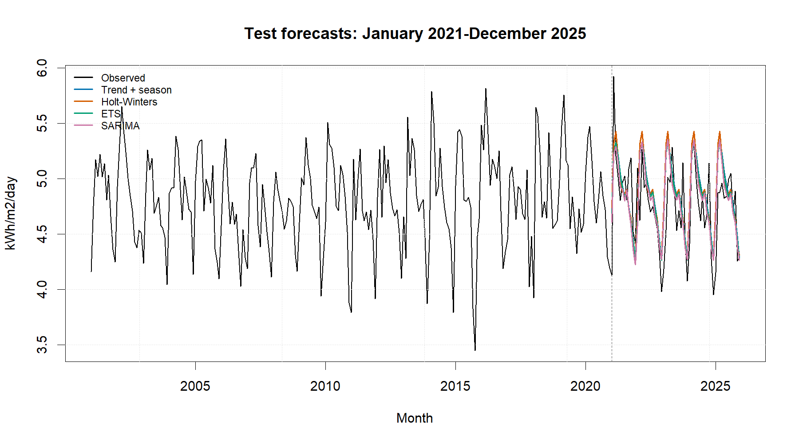

::: {custom-style="Author"}
[Member 1 name], [Member 2 name], [Member 3 name], and [Member 4 name]
:::

::: {custom-style="Affiliation"}
[Faculty name], [University name]  
BMMS2094 Statistics for Data Science · [Semester / session] · [Tutorial / group identifier]  
Submission date: [DD Month YYYY]
:::

```{=openxml}
<w:p>
  <w:pPr>
    <w:sectPr>
      <w:type w:val="continuous"/>
      <w:pgSz w:w="12240" w:h="15840"/>
      <w:pgMar w:top="1080" w:right="893" w:bottom="1440" w:left="893" w:header="720" w:footer="720" w:gutter="0"/>
      <w:cols w:num="1" w:space="720"/>
      <w:docGrid w:linePitch="360"/>
    </w:sectPr>
  </w:pPr>
</w:p>
```

::: {custom-style="Abstract"}
**Abstract—**This study compares seasonal ARIMA, additive Holt–Winters, ETS, and trend-plus-season regression for forecasting monthly NASA POWER surface solar irradiance in Kuala Lumpur. Models are evaluated on a common January 2021–December 2025 test period using accuracy, residual diagnostics, and physical-plausibility checks. SARIMA achieved the strongest admissible result, although its advantage over ETS was modest.
:::

::: {custom-style="Keywords"}
**Keywords—**ETS, forecasting, Holt–Winters, NASA POWER, regression, SARIMA, solar irradiance.
:::

# Introduction

Monthly solar-resource variability affects preliminary photovoltaic feasibility studies, storage sizing, maintenance scheduling, and energy-planning decisions. This study forecasts surface solar irradiance for Kuala Lumpur using NASA POWER's monthly `ALLSKY_SFC_SW_DWN` series at 3.139° N, 101.6869° E. NASA POWER supplies analysis-ready point time series and documents that its monthly solar fields combine satellite-derived archives rather than local ground-station measurements [@nasa-power-monthly]. The dataset contains 300 continuous observations from January 2001 through December 2025 in kWh/m²/day.

The objectives were to (1) audit and describe the monthly series; (2) fit and diagnose SARIMA, additive Holt–Winters, ETS, and multiple linear regression with trend and monthly effects; (3) compare locked specifications on a common 60-month chronological test using RMSE, MAE, MAPE, MASE, and sMAPE; and (4) interpret the selected model for solar-resource planning. The work supports United Nations Sustainable Development Goal 7, *Affordable and Clean Energy*, particularly Target 7.2 on increasing renewable energy's share [@un-sdg7]. Irradiance is a resource indicator, however, and is not equivalent to photovoltaic electricity output.

# Methodology

The NASA JSON response was to be parsed by year-month. Annual-summary keys such as `YYYY13` would be excluded, and `-999` would be treated as NASA's fill value. The cleaned series would be checked for the expected coverage, missing values, duplicate dates, chronological continuity, and implausible negative irradiance before being represented as a monthly time series with frequency 12.

An 80:20 chronological split would be fixed before final testing: January 2001–December 2020 for estimation and January 2021–December 2025 for evaluation. Random splitting would be avoided because it leaks future information. This whole-season design was chosen over alternatives that break annual boundaries or reduce the available training history, thereby balancing seasonal integrity, parameter stability, and a demanding multi-year test.

The training series would be examined using time and seasonal plots, monthly summaries, STL decomposition, variance diagnostics, and differencing tests. Any need for a variance-stabilising transformation would be assessed from the training data by comparing transformed and untransformed diagnostics. This proposal-stage methodology specifies that decision process without reporting an estimated transformation value or other empirical outcome. SARIMA candidates would be searched seasonally and exhaustively (`stepwise = FALSE`, `approximation = FALSE`) with drift considered where valid. Holt–Winters would assess seasonal and trend components, ETS would search the error–trend–season space, and regression would use `y ~ trend + season`. These methods represent complementary serial-dependence, smoothing, state-space, and interpretable deterministic approaches [@hyndman-athanasopoulos-2021; @hyndman-khandakar-2008].

Response residuals (`observed − fitted`) would be used consistently [@forecast-residuals]. Residual time plots, ACFs, and Ljung–Box tests at lag 24 would be evaluated with fitted degrees of freedom; $p>0.05$ would indicate insufficient evidence against residual white noise. Test RMSE would be the primary ranking metric and MAE secondary, subject to white-noise diagnostics and non-negative forecasts. The analysis would be implemented reproducibly in R using the `forecast` and `jsonlite` packages [@forecast-package; @r-core-2026].

# Data Analysis

The complete series averaged 4.7927 kWh/m²/day (SD 0.4061; range 3.4478–5.9244). Calendar-month means show a marked annual cycle: March was highest (5.2456), while December was lowest (4.2005). The overview and STL panels indicate recurring seasonality with comparatively modest long-term movement.

{width=3.20in}

{width=3.20in}

| Model | Locked specification | RMSE | MAE |
|---|---|---:|---:|
| SARIMA | ARIMA(0,0,2)(2,1,1)[12] | **0.2928** | **0.2245** |
| ETS | ETS(A,N,A) | 0.2947 | 0.2351 |
| Trend + season | `tslm(y ~ trend + season)` | 0.2988 | 0.2414 |
| Holt–Winters | Additive; no trend | 0.3101 | 0.2464 |

| Model | MAPE (%) | MASE | sMAPE (%) | Ljung–Box p |
|---|---:|---:|---:|---:|
| SARIMA | **4.7346** | **0.7563** | **4.6872** | 0.2129 |
| ETS | 4.9673 | 0.7920 | 4.8996 | 0.0720 |
| Trend + season | 5.1093 | 0.8130 | 5.0270 | **0.0006** |
| Holt–Winters | 5.2213 | 0.8300 | 5.1149 | 0.1491 |

{width=3.20in}

SARIMA ranked first and passed the diagnostic and physical-plausibility gates. Its RMSE was only 0.0019 kWh/m²/day (0.65%) below ETS, so the predictive advantage is modest rather than decisive. ETS was a statistically acceptable close second. Holt–Winters also passed its white-noise test but produced the largest errors, suggesting that slowly adapting level and seasonal components were too restrictive. Regression ranked third by RMSE but failed the residual eligibility condition; its fixed month indicators and linear trend left material serial dependence.

The selected SARIMA contains one annual difference, two ordinary moving-average terms, two seasonal autoregressive terms, and one seasonal moving-average term. This structure directly represents recurring annual change and serial dependence. Re-estimating the locked order on all 300 observations produced MA(1)=0.2126, MA(2)=0.1008, seasonal AR(1)=−0.0013, seasonal AR(2)=−0.0774, and seasonal MA(1)=−0.9343. The 2026 point forecasts range from 4.2238 in December to 5.2472 in March; all 95% lower limits remain positive. These are future forecasts and were not used in the 2021–2025 comparison.

# Conclusion

SARIMA provided the strongest admissible result for this dataset: RMSE 0.2928, MAE 0.2245, and Ljung–Box $p=0.2129$. Its narrow advantage over ETS shows that the conclusion should be treated as a defensible selection for the present sample, not evidence of universal superiority. The pattern supports annual seasonality and short/seasonal dependence, while the uncertain regression trend cautions against asserting strong long-run growth.

Seasonal irradiance forecasts can inform early-stage renewable-resource assessment, maintenance timing, and storage planning aligned with SDG 7.2, but engineering decisions additionally require panel efficiency, temperature, shading, system losses, demand, and cost data. Further limitations include the gridded satellite product, monthly averaging, source-archive changes, absence of ground-station validation, structural-change risk, and uncertainty over the five-year horizon. Recommended extensions are local validation, rolling-origin model selection, a Box–Cox sensitivity analysis, higher-frequency weather predictors, regression with ARIMA errors, forecast combinations, and scheduled re-estimation as new observations arrive.

::: {custom-style="Heading 5"}
Author Contributions
:::

| Member | Student ID | Contribution |
|---|---|---:|
| [Member 1 name] | [ID] | [25%] |
| [Member 2 name] | [ID] | [25%] |
| [Member 3 name] | [ID] | [25%] |
| [Member 4 name] | [ID] | [25%] |
| **Total** |  | **100%** |

::: {custom-style="Heading 5"}
References
:::

::: {#refs}
:::
