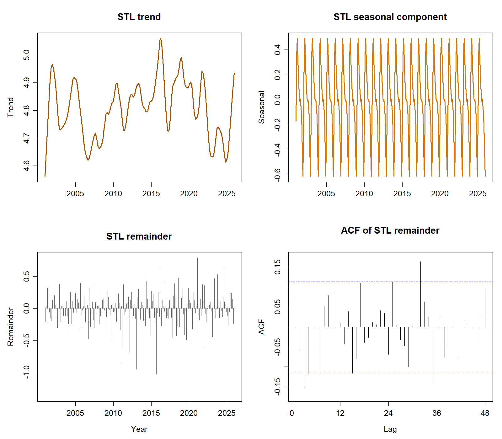

::: {custom-style="Author"}
[Member 1 name], [Member 2 name], [Member 3 name], and [Member 4 name]
:::

::: {custom-style="Affiliation"}
[Faculty name], [University name]  
BMMS2094 Statistics for Data Science · [Semester / session] · [Tutorial / group identifier]  
Submission date: [DD Month YYYY]
:::

```{=openxml}
<w:p>
  <w:pPr>
    <w:sectPr>
      <w:type w:val="continuous"/>
      <w:pgSz w:w="12240" w:h="15840"/>
      <w:pgMar w:top="1080" w:right="893" w:bottom="1440" w:left="893" w:header="720" w:footer="720" w:gutter="0"/>
      <w:cols w:num="1" w:space="720"/>
      <w:docGrid w:linePitch="360"/>
    </w:sectPr>
  </w:pPr>
</w:p>
```

::: {custom-style="Abstract"}
**Abstract—**This study compares ARIMA, Holt–Winters, ETS, and linear regression for forecasting monthly NASA POWER surface solar irradiance in Kuala Lumpur. Models are evaluated on a common January 2021–December 2025 test period using accuracy, residual diagnostics, and physical-plausibility checks. ARIMA achieved the strongest admissible result, although its advantage over ETS was modest.
:::

::: {custom-style="Keywords"}
**Keywords—**ARIMA, ETS, forecasting, Holt–Winters, linear regression, NASA POWER, solar irradiance.
:::

# Introduction

Monthly solar-resource variability affects preliminary photovoltaic feasibility studies, storage sizing, maintenance scheduling, and energy-planning decisions. This study forecasts surface solar irradiance for Kuala Lumpur using NASA POWER's monthly `ALLSKY_SFC_SW_DWN` series at 3.139° N, 101.6869° E. NASA POWER supplies analysis-ready point time series and documents that its monthly solar fields combine satellite-derived archives rather than local ground-station measurements [@nasa-power-monthly]. The dataset contains 300 continuous observations from January 2001 through December 2025 in kWh/m²/day.

The objectives were to (1) audit and describe the monthly series; (2) fit and diagnose ARIMA, Holt–Winters, ETS, and linear regression models; (3) compare the fitted models on a common 60-month chronological test using ME, MSE, RMSE, MAE, MPE, and MAPE; and (4) interpret the selected model for solar-resource planning. The work supports United Nations Sustainable Development Goal 7, *Affordable and Clean Energy*, particularly Target 7.2 on increasing renewable energy's share [@un-sdg7]. Irradiance is a resource indicator, however, and is not equivalent to photovoltaic electricity output.

# Methodology

The NASA JSON response was to be parsed by year-month. Annual-summary keys such as `YYYY13` would be excluded, and `-999` would be treated as NASA's fill value. The cleaned series would be checked for the expected coverage, missing values, duplicate dates, chronological continuity, and implausible negative irradiance before being represented as a monthly time series with frequency 12.

An 80:20 chronological split would be fixed before final testing: January 2001–December 2020 for estimation and January 2021–December 2025 for evaluation. Random splitting would be avoided because it leaks future information. This whole-season design was chosen over alternatives that break annual boundaries or reduce the available training history, thereby balancing seasonal integrity, parameter stability, and a demanding multi-year test.

The training series would be examined using time and seasonal plots, monthly summaries, decomposition, variance diagnostics, and differencing tests. Any need for a variance-stabilising transformation would be assessed from the training data by comparing transformed and untransformed diagnostics. This proposal-stage methodology specifies the decision process without reporting an estimated transformation value or other empirical outcome.

Four basic forecasting models were selected for the research. ARIMA was selected because it can represent serial dependence and recurring patterns in a time series. Holt–Winters was selected because it can update the series level, trend, and seasonality through smoothing. ETS was selected because its state-space framework can represent changing components and forecast uncertainty. Linear regression was selected because it provides a clear and interpretable representation of trend and seasonal effects. Specific model variants, settings, and estimated parameters are reserved for the individual reports. Together, the four models provide broad coverage of serial-dependence, smoothing, state-space, and deterministic forecasting approaches [@hyndman-athanasopoulos-2021; @hyndman-khandakar-2008].

Response residuals (`observed − fitted`) would be used consistently [@forecast-residuals]. The common accuracy set would comprise ME, MSE, RMSE, MAE, MPE, and MAPE. ME and MPE would be judged by closeness to zero and their signs used to identify underforecasting or overforecasting; the other four measures would be minimised. Because MSE and RMSE induce the same ordering, they would not be treated as independent votes. Residual time plots, ACFs, and Ljung–Box tests at lag 24 would be evaluated with fitted degrees of freedom; $p>0.05$ would indicate insufficient evidence against residual white noise. Test RMSE would be the primary ranking metric and MAE secondary, subject to white-noise diagnostics and non-negative forecasts. The analysis would be implemented reproducibly in R using the `forecast` and `jsonlite` packages [@forecast-package; @r-core-2026].

# Data Analysis

The complete series averaged 4.7927 kWh/m²/day (SD 0.4061; range 3.4478–5.9244). Calendar-month means show a marked annual cycle: March was highest (5.2456), while December was lowest (4.2005). The overview and STL panels indicate recurring seasonality with comparatively modest long-term movement.

{width=3.20in}

{width=3.20in}

| Model | ME | MSE | RMSE | MAE | MPE | MAPE |
|---|---:|---:|---:|---:|---:|---:|
| SARIMA | −0.0566 | 0.0857 | 0.2928 | 0.2245 | −1.4643% | 4.7346% |
| ETS | −0.0847 | 0.0869 | 0.2947 | 0.2351 | −2.0546% | 4.9673% |
| Trend + season | −0.0989 | 0.0893 | 0.2988 | 0.2414 | −2.3584% | 5.1093% |
| Holt–Winters | −0.1037 | 0.0962 | 0.3101 | 0.2464 | −2.4553% | 5.2213% |

On the common test period, SARIMA had the lowest MSE, RMSE, MAE, and MAPE and the ME and MPE closest to zero. Negative ME and MPE for every model indicate average overforecasting under the declared `actual − forecast` convention. Residual checks were also considered when determining whether a model was admissible.

ARIMA ranked first and passed the diagnostic and physical-plausibility gates. Its RMSE was only 0.0019 kWh/m²/day (0.65%) below ETS, so the predictive advantage is modest rather than decisive. ETS was a statistically acceptable close second. Holt–Winters also passed its white-noise test but produced the largest errors. Linear regression ranked third by RMSE but failed the residual eligibility condition because material serial dependence remained.

The selected ARIMA model represents recurring annual patterns and serial dependence in the irradiance series. After selection, it was refitted using the complete dataset to produce the 2026 forecasts. These future forecasts were not used in the 2021–2025 model comparison.

# Conclusion

ARIMA provided the strongest admissible result for this dataset: RMSE 0.2928, MAE 0.2245, and Ljung–Box $p=0.2129$. Its narrow advantage over ETS shows that the conclusion should be treated as a defensible selection for the present sample, not evidence of universal superiority. The pattern supports annual seasonality and serial dependence, while the uncertain regression trend cautions against asserting strong long-run growth.

Seasonal irradiance forecasts can inform early-stage renewable-resource assessment, maintenance timing, and storage planning aligned with SDG 7.2, but engineering decisions additionally require panel efficiency, temperature, shading, system losses, demand, and cost data. Further limitations include the gridded satellite product, monthly averaging, source-archive changes, absence of ground-station validation, structural-change risk, and uncertainty over the five-year horizon. Recommended extensions are local validation, rolling-origin evaluation, additional weather predictors, forecast combinations, and scheduled re-estimation as new observations arrive.

::: {custom-style="Heading 5"}
Author Contributions
:::

[Member 1 name] ([ID]): [25%]

[Member 2 name] ([ID]): [25%]

[Member 3 name] ([ID]): [25%]

[Member 4 name] ([ID]): [25%]

**Total: 100%**

::: {custom-style="Heading 5"}
References
:::

::: {#refs}
:::
