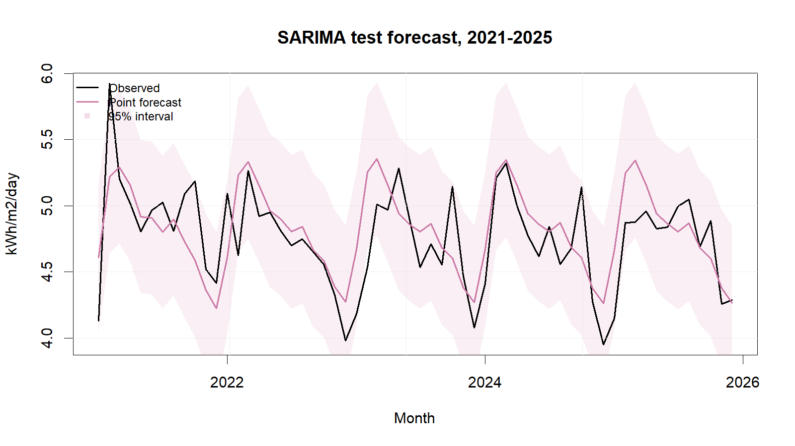
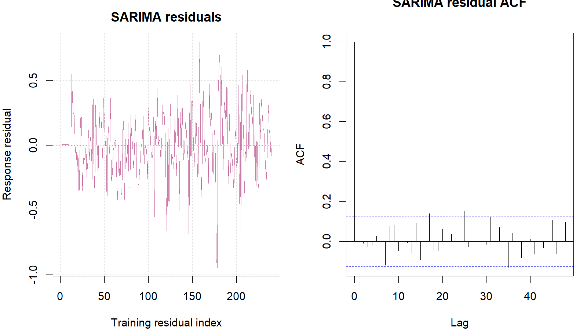

::: {custom-style="Author"}
[Member 1 name]
:::

::: {custom-style="Affiliation"}
[University and faculty]  
BMMS2094 Statistics for Data Science · Student ID: [ID] · Tutorial/Group: [Identifier]  
Assigned model: Seasonal ARIMA · Submission date: [DD Month YYYY]
:::

```{=openxml}
<w:p><w:pPr><w:sectPr><w:type w:val="continuous"/><w:pgSz w:w="12240" w:h="15840"/><w:pgMar w:top="1080" w:right="893" w:bottom="1440" w:left="893" w:header="720" w:footer="720" w:gutter="0"/><w:cols w:num="1" w:space="720"/><w:docGrid w:linePitch="360"/></w:sectPr></w:pPr></w:p>
```

::: {custom-style="Abstract"}
**Abstract—**This report evaluates seasonal ARIMA for monthly NASA POWER surface solar irradiance in Kuala Lumpur using a fixed 240-month training period and 60-month test period. The selected ARIMA(0,0,2)(2,1,1)~12~ model achieved RMSE 0.2928 and passed the lag-24 residual white-noise test.
:::

::: {custom-style="Keywords"}
**Keywords—**forecasting, NASA POWER, SARIMA, seasonal differencing, solar irradiance.
:::

# Methodology

This report proposes evaluating SARIMA for monthly Kuala Lumpur solar irradiance (kWh/m²/day) from NASA POWER [@nasa-power-monthly]. SARIMA is a reasonable candidate because it can represent ordinary and annual-lag dependence after differencing. A seasonal model is written as ARIMA$(p,d,q)(P,D,Q)_{12}$, where $p/q$ and $P/Q$ are ordinary/seasonal AR and MA orders, while $d/D$ are ordinary/seasonal differences [@hyndman-athanasopoulos-2021].

The observations were to be split chronologically into a January 2001–December 2020 training period and a January 2021–December 2025 test period. Both contain complete 12-month cycles; random splitting was rejected to prevent future leakage. An exact 70:30 split breaks annual boundaries, while 72:28 sacrifices two additional training years. The need for a variance-stabilising transformation would be assessed using training data only, with the response scale preferred when diagnostics did not justify transformation and common interpretation remained important.

Training plots, monthly summaries, STL decomposition, and stationarity diagnostics would guide ordinary and seasonal differencing. KPSS-guided `ndiffs()` and seasonal-strength `nsdiffs()` would inform $d$ and $D$. `auto.arima()` would then search seasonal orders exhaustively with `stepwise=FALSE`, `approximation=FALSE`, `allowdrift=TRUE`, and AICc selection [@hyndman-khandakar-2008]. The selected order, coefficients, uncertainty, information criterion, and mean or drift status would be reported with the results rather than predetermined in the methodology.

Response residuals would be assessed over time, by ACF, and with a lag-24 Ljung–Box test using fitted degrees of freedom [@forecast-checkresiduals]. Material residual autocorrelation would trigger a loop back to model identification. Evaluation would use RMSE primarily, MAE secondarily, with MAPE, MASE, and sMAPE as supporting measures.

# Results, Discussion, and Conclusion

Training diagnostics selected ARIMA$(0,0,2)(2,1,1)_{12}$ without mean or drift (AICc=105.397). Estimates (SE) were MA1=0.2248 (0.0678), MA2=0.0903 (0.0696), SAR1=−0.0086 (0.0870), SAR2=−0.1301 (0.0824), and SMA1=−0.8869 (0.0959). At lag 24 with five fitted degrees of freedom, the Ljung–Box result was $Q=23.577$, $p=.213$, so residual white noise was not rejected.

| Test metric | Value |
|---|---:|
| RMSE (kWh/m²/day) | 0.2928 |
| MAE (kWh/m²/day) | 0.2245 |
| MAPE | 4.7346% |
| MASE | 0.7563 |
| sMAPE | 4.6872% |
| Ljung–Box p-value | 0.2129 |

{width=3.20in}

SARIMA achieved the lowest group test RMSE and MAE, passed the residual gate, and produced non-negative point forecasts. Its RMSE was only 0.65% below ETS, however, so the practical advantage is modest. Strengths are its direct treatment of seasonal differencing and lag dependence and its well-behaved residuals. Limitations include order-search uncertainty, possible sensitivity to transformation and structural change, weakening precision at long horizons, and limited substantive interpretability of interacting MA/SAR terms.

The locked order was re-estimated—not merely copied—on all 300 observations for 2026. Updated coefficients were MA1=0.2126, MA2=0.1008, SAR1=−0.0013, SAR2=−0.0774, and SMA1=−0.9343. Point forecasts ranged from 4.2238 (December) to 5.2472 (March), consistent with the observed seasonal cycle. SARIMA is suitable and is the defensible final model for this sample, but nearby manual orders, rolling-origin validation, Box–Cox alternatives, and weather regressors should be tested before operational use. Irradiance forecasts do not directly predict photovoltaic electricity generation.

::: {custom-style="Heading 5"}
References
:::

::: {#refs}
:::

::: {custom-style="Heading 5"}
Appendix A: Reproducible SARIMA Code
:::

Canonical source: `../NASA_Solar_Irradiance_Forecasting.R`. No random procedure is used, so no random seed is required.

{width=3.20in}

```r
train <- window(series, end = c(2020, 12))
test  <- window(series, start = c(2021, 1))

sarima_fit <- auto.arima(
  train, seasonal = TRUE, stepwise = FALSE,
  approximation = FALSE, allowdrift = TRUE
)
sarima_fc <- forecast(sarima_fit, h = length(test), level = c(80, 95))
response_residuals <- as.numeric(train) - as.numeric(fitted(sarima_fit))
Box.test(response_residuals, lag = 24, type = "Ljung-Box",
         fitdf = length(coef(sarima_fit)))
metric_row("SARIMA", sarima_fc, test, train)
```
