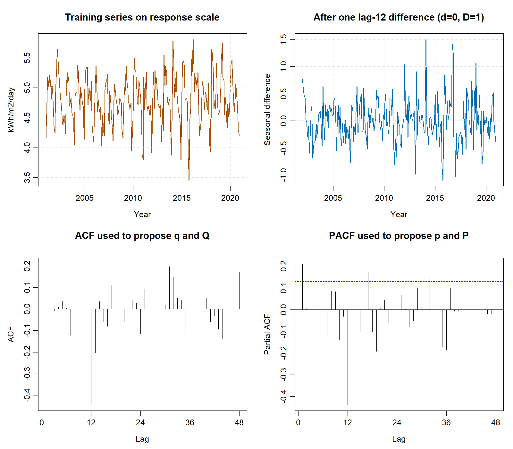
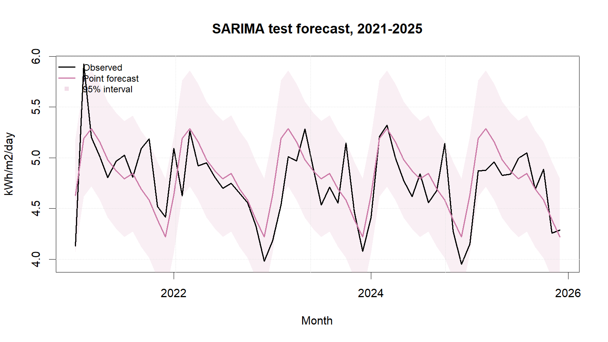

::: {custom-style="Author"}
[Member 1 name]
:::

::: {custom-style="Affiliation"}
[University and faculty]  
BMMS2094 Statistics for Data Science · Student ID: [ID] · Tutorial/Group: [Identifier]  
Assigned model: Seasonal ARIMA · Submission date: [DD Month YYYY]
:::

```{=openxml}
<w:p><w:pPr><w:sectPr><w:type w:val="continuous"/><w:pgSz w:w="12240" w:h="15840"/><w:pgMar w:top="1080" w:right="893" w:bottom="1440" w:left="893" w:header="720" w:footer="720" w:gutter="0"/><w:cols w:num="1" w:space="720"/><w:docGrid w:linePitch="360"/></w:sectPr></w:pPr></w:p>
```

# Methodology

This report proposes evaluating SARIMA for monthly Kuala Lumpur solar irradiance (kWh/m²/day) from NASA POWER [@nasa-power-monthly]. SARIMA is a reasonable candidate because it can represent ordinary and annual-lag dependence after differencing. A seasonal model is written as ARIMA$(p,d,q)(P,D,Q)_{12}$, where $p/q$ and $P/Q$ are ordinary/seasonal AR and MA orders, while $d/D$ are ordinary/seasonal differences [@hyndman-athanasopoulos-2021].

An 80:20 chronological split would use January 2001–December 2020 for training and January 2021–December 2025 for testing; chronological order would prevent future leakage. The need for a variance-stabilising transformation would be assessed using training data only, with the response scale preferred when diagnostics did not justify transformation and direct interpretation remained important.

Model identification would follow the Box--Jenkins sequence manually using the training sample only. First, the time plot, year-level means and standard deviations, and Guerrero's Box--Cox estimate would be reviewed together; a transformation would be applied only if the seasonal spread clearly changed with the level. Second, $D$ would be chosen by inspecting annual repetition and the lag-12 difference, with `nsdiffs()` used only as supporting evidence; $d$ would then be chosen from the post-seasonal-difference plot, ACF, and KPSS evidence, with `ndiffs()` again treated as a check rather than an automatic decision. The smallest adequate differencing orders would be preferred to avoid overdifferencing.

Third, the ACF and PACF of the locked differenced series would be read at ordinary lags 1--2 and seasonal lags 12 and 24. An ACF cut-off would suggest MA terms, a PACF cut-off would suggest AR terms, and spikes at multiples of 12 would suggest seasonal terms. These diagnostics would define a restricted diagnostic-guided search, not an unrestricted search over every possible SARIMA order. Monthly frequency would fix $m=12$; the differencing evidence would fix $d=0$ and $D=1$; and the seasonal ACF cut-off would fix $Q=1$. The ambiguous ordinary lag-1 ACF/PACF would motivate testing $p,q\in\{0,1,2\}$, while the seasonal PACF evidence would motivate $P\in\{0,1,2\}$. The Cartesian product would therefore contain exactly $3\times3\times3=27$ candidates, including zero-order baselines, first-order interpretations, and nearby second-order sensitivity models. Each would be fitted explicitly with `forecast::Arima()` under the same response scale, no mean or drift, and CSS--ML estimation. Candidates would be ranked by training AICc; the lowest-AICc converged candidate would be accepted only if its response residuals passed a lag-24 Ljung--Box test at 5% with fitted degrees of freedom and its 60 point forecasts were non-negative. A failed gate would trigger the next AICc-ranked candidate. The accepted order would then be locked before the January 2021--December 2025 actual values were used for evaluation. Coefficients would be likelihood estimates rather than values chosen by hand.

Response residuals would be assessed over time, by ACF, and with a lag-24 Ljung–Box test using fitted degrees of freedom [@forecast-checkresiduals]. Material residual autocorrelation would trigger a loop back to model identification. Training and test performance would be reported consistently using ME, MSE, RMSE, MAE, MPE, and MAPE, together with each test-minus-training difference. RMSE would remain primary and MAE secondary; ME and MPE would be interpreted by closeness to zero and sign.

# Data Analysis (Results and Discussion)

**Step 1 - set the seasonal period and transformation.** Monthly observations imply $m=12$. The training plot showed a recurring annual pattern with broadly stable absolute amplitude. The correlation between each training year's mean and standard deviation was only 0.261. Although Guerrero's diagnostic gave a Box--Cox estimate of $\lambda=-0.622$, the visual and mean--spread evidence did not show variance increasing clearly with level. The response scale was therefore retained so forecasts remain directly interpretable in kWh/m²/day.

{width=3.20in}

```{=openxml}
<w:p><w:r><w:br w:type="column"/></w:r></w:p>
```

**Step 2 - choose $D$ and $d$.** The original ACF remained high at annual multiples (lag 12 = 0.521, lag 24 = 0.456, and lag 36 = 0.486), supporting one seasonal difference. The seasonal-strength check also returned `nsdiffs = 1`, so $D=1$. After applying $y_t-y_{t-12}$, the series fluctuated around a stable level; the KPSS supporting check returned `ndiffs = 0`. Thus $d=0$, avoiding an unnecessary ordinary difference.

**Step 3 - propose $p$, $q$, $P$, and $Q$.** For the seasonally differenced series, the approximate 95% bound was $\pm0.130$. At ordinary lag 1, ACF and PACF were both 0.211, so neither an AR nor an MA interpretation was uniquely indicated. Therefore, $p$ and $q$ each ranged from 0 to 2: order 0 tests absence of that component, order 1 represents the main lag-1 evidence, and order 2 is a nearby sensitivity check rather than a claim that lag 2 was independently significant. At seasonal lag 12, ACF was -0.445 and then fell to -0.116 at lag 24, favouring the fixed $Q=1$. PACF spikes at lags 12 and 24 justified $P=0,1,2$, where $P=0$ is the parsimonious baseline and $P=1,2$ test seasonal AR explanations. Together these choices produced exactly 27 unique candidates. This was exhaustive only within the declared bounded grid; the complete comparison is stored in `nasa_sarima_manual_candidate_comparison.csv`.

| Leading AICc-ranked candidate | AICc | $Q(24)$ $p$ | Decision |
|---|---:|---:|---|
| (1,0,0)(0,1,1)~12~ | 102.270 | 0.105 | Selected |
| (0,0,1)(0,1,1)~12~ | 103.192 | 0.153 | Eligible |
| (1,0,0)(2,1,1)~12~ | 103.839 | 0.346 | Eligible |
| (0,0,2)(0,1,1)~12~ | 103.922 | 0.046 | Rejected |
| (1,0,0)(1,1,1)~12~ | 104.074 | 0.084 | Eligible |
| (2,0,0)(0,1,1)~12~ | 104.212 | 0.074 | Eligible |
| (1,0,1)(0,1,1)~12~ | 104.247 | 0.077 | Eligible |
| (0,0,1)(2,1,1)~12~ | 104.978 | 0.400 | Eligible |

**Step 4 - select and diagnose the model.** All candidates used the same untransformed training sample, $d=0$, $D=1$, $m=12$, no mean or drift, and CSS--ML estimation. ARIMA$(1,0,0)(0,1,1)_{12}$ had the lowest training AICc and passed the declared residual and non-negativity gates. Its fitted coefficients were AR1=0.2087 (SE=0.0653, $p=0.0014$) and SMA1=-0.9554 (SE=0.1190, $p<0.001$). The lag-24 Ljung--Box result was $Q=30.601$ with 22 degrees of freedom and $p=0.1046$, so residual white noise was not rejected. No extra terms were added after this gate passed.

| Metric | Training | Test | Test − training |
|---|---:|---:|---:|
| ME (kWh/m²/day) | 0.0083 | −0.0451 | −0.0534 |
| MSE ((kWh/m²/day)²) | 0.0753 | 0.0812 | 0.0060 |
| RMSE (kWh/m²/day) | 0.2743 | 0.2850 | 0.0107 |
| MAE (kWh/m²/day) | 0.2046 | 0.2198 | 0.0152 |
| MPE | −0.1483% | −1.2191% | −1.0708 pp |
| MAPE | 4.3377% | 4.6224% | 0.2847 pp |

The negative test ME and MPE indicate average overforecasting under the `actual − forecast` convention. Training–test differences are descriptive because fitted residuals and multi-step holdout errors come from different evaluation settings.

{width=3.20in}

**Step 5 - evaluate on unseen observations.** The locked SARIMA achieved test RMSE 0.2850 and MAE 0.2198 and produced non-negative point forecasts. The holdout actual values were used to evaluate the already-selected order, not to choose among the 27 candidates. Strengths are its parsimonious structure, direct treatment of annual dependence, and acceptable residuals. Limitations include sensitivity to the transformation decision, structural change, and weakening precision at longer horizons.

# Conclusion

The restricted diagnostic-guided search selected ARIMA$(1,0,0)(0,1,1)_{12}$: $m=12$ came from monthly frequency, $D=1$ from persistent annual dependence, $d=0$ from the stationary post-seasonal-difference behaviour, and $Q=1$ from the seasonal ACF cut-off. The selected $p=1$, $q=0$, and $P=0$ combination had the lowest eligible training AICc within the 27-model grid. The model achieved test RMSE 0.2850 and MAE 0.2198, while the lag-24 Ljung--Box result did not reject residual white noise. These results evaluate the model only where actual values are available. Rolling-origin validation and weather regressors should be examined before operational use. Irradiance forecasts do not directly predict photovoltaic electricity generation.

# References

::: {#refs}
:::

# Appendix

## Appendix A: Reproducible SARIMA Code

Canonical source: `../NASA_Solar_Irradiance_Forecasting.R`. No random procedure is used, so no random seed is required.

{width=3.20in}

```r
train <- window(series, end = c(2020, 12))
test  <- window(series, start = c(2021, 1))

# Manual transformation and differencing decisions, based on training only.
BoxCox.lambda(train, method = "guerrero")       # supporting diagnostic
ndiffs(train, test = "kpss")                    # supporting diagnostic
nsdiffs(train, test = "seas")                   # supporting diagnostic
d <- 0L; D <- 1L; m <- 12L                       # decisions after plot review
identified <- diff(train, lag = m, differences = D)
Acf(identified, lag.max = 48)
Pacf(identified, lag.max = 48)

# Restricted 3 x 3 x 3 grid based on the training diagnostics.
candidates <- expand.grid(
  p = 0:2, q = 0:2, P = 0:2,
  KEEP.OUT.ATTRS = FALSE
)
stopifnot(nrow(candidates) == 27L, nrow(unique(candidates)) == 27L)

fits <- lapply(seq_len(nrow(candidates)), function(i) tryCatch(
  Arima(
    train, order = c(candidates$p[i], d, candidates$q[i]),
    seasonal = list(order = c(candidates$P[i], D, 1L), period = m),
    include.mean = FALSE, include.drift = FALSE, method = "CSS-ML"
  ),
  error = function(e) e
))

# Failed or non-converged fits remain in the audit table but cannot be selected.
fitted_ok <- !vapply(fits, inherits, logical(1), what = "error")
candidate_aicc <- rep(Inf, length(fits))
converged <- passes_gate <- nonnegative <- rep(FALSE, length(fits))
for (i in which(fitted_ok)) {
  candidate_aicc[i] <- fits[[i]]$aicc
  converged[i] <- is.null(fits[[i]]$code) || fits[[i]]$code == 0L
  residual <- as.numeric(train) - as.numeric(fitted(fits[[i]]))
  passes_gate[i] <- Box.test(
    residual, lag = 24, type = "Ljung-Box",
    fitdf = length(coef(fits[[i]]))
  )$p.value > 0.05
  # Forecasts set the plausibility gate but are not compared with test actuals.
  candidate_fc <- forecast(fits[[i]], h = 60L)
  nonnegative[i] <- all(as.numeric(candidate_fc$mean) >= 0)
}
ranked <- order(candidate_aicc)
eligible <- converged & passes_gate & nonnegative
selected_index <- ranked[which(eligible[ranked])[1]]
sarima_fit <- fits[[selected_index]]
# Only after the order is locked are the holdout actual values used for evaluation.
sarima_fc <- forecast(sarima_fit, h = length(test), level = c(80, 95))
```
