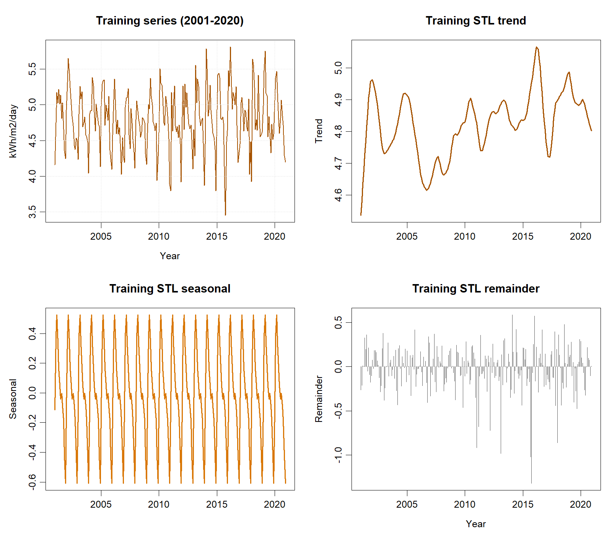
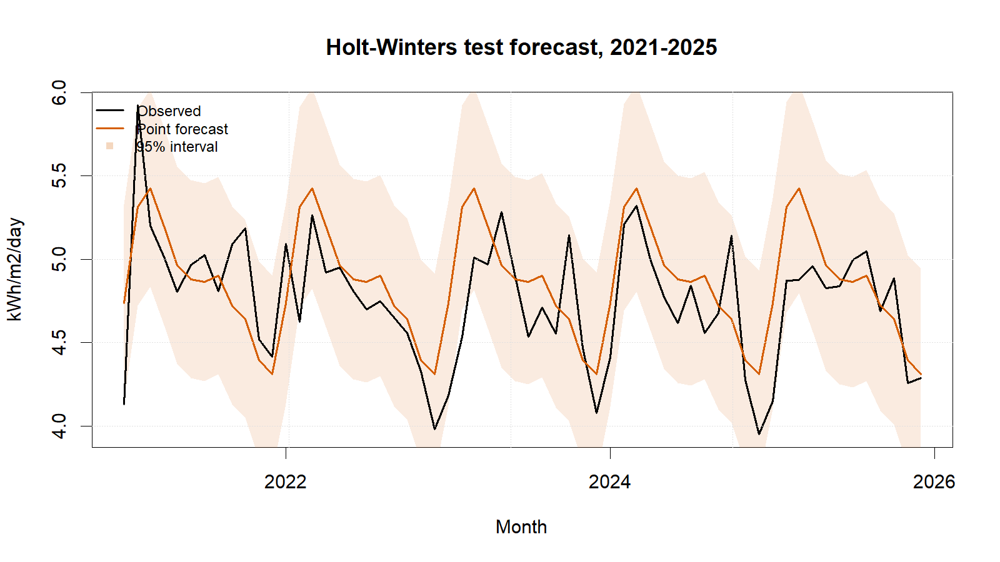
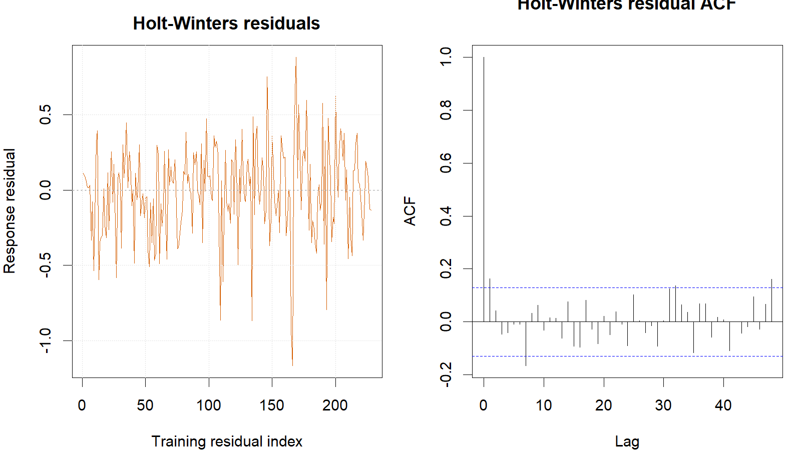

::: {custom-style="Author"}
[Member 2 name]
:::

::: {custom-style="Affiliation"}
[University and faculty]  
BMMS2094 Statistics for Data Science · Student ID: [ID] · Tutorial/Group: [Identifier]  
Assigned model: Additive Holt–Winters · Submission date: [DD Month YYYY]
:::

```{=openxml}
<w:p><w:pPr><w:sectPr><w:type w:val="continuous"/><w:pgSz w:w="12240" w:h="15840"/><w:pgMar w:top="1080" w:right="893" w:bottom="1440" w:left="893" w:header="720" w:footer="720" w:gutter="0"/><w:cols w:num="1" w:space="720"/><w:docGrid w:linePitch="360"/></w:sectPr></w:pPr></w:p>
```

::: {custom-style="Abstract"}
**Abstract—**This report evaluates additive Holt–Winters forecasting without a trend for monthly NASA POWER surface solar irradiance in Kuala Lumpur. The model preserved the annual cycle, passed residual diagnostics, and achieved test RMSE 0.3101.
:::

::: {custom-style="Keywords"}
**Keywords—**additive seasonality, exponential smoothing, forecasting, Holt–Winters, solar irradiance.
:::

# Methodology

This report proposes evaluating Holt–Winters exponential smoothing for monthly NASA POWER solar irradiance in Kuala Lumpur [@nasa-power-monthly]. The method recursively updates level and month-specific seasonal states; a trend state is optional. Additive and multiplicative seasonality would be considered according to whether seasonal amplitude was stable in absolute units or proportional to the series level [@hyndman-athanasopoulos-2021].

The chronological design would use January 2001–December 2020 for training and January 2021–December 2025 for testing. Both partitions contain complete annual cycles, whereas random splitting would leak future data and exact 70:30 would break seasonal boundaries. The need for transformation would be assessed from training diagnostics only, with response-scale modelling preferred for interpretability and direct reporting of errors when transformation was unnecessary.

Training plots and STL decomposition would inform the seasonal form and whether a trend component was warranted. Additive and multiplicative seasonality, and models with or without trend smoothing, were the structural alternatives. Additive seasonality would be retained only when seasonal amplitude was approximately constant in response units; multiplicative seasonality would require amplitude proportional to level. Setting `beta=FALSE` is a deliberate modification, not a neutral default, and would be used only when training evidence did not support persistent trend extrapolation. Because STL is descriptive and additive in form, these decisions would also use the original training plot, variance evidence, coefficient uncertainty, and candidate behaviour. R would optimise the applicable smoothing coefficients by minimising one-step squared errors; α and γ would therefore be fitted rather than manually selected.

Response residuals would be inspected over time and by ACF, followed by a lag-24 Ljung–Box test with the appropriate fitted degrees of freedom [@forecast-checkresiduals]. Material remaining autocorrelation would trigger reconsideration of the specification. After the model was locked, training and test performance would be reported consistently using ME, MSE, RMSE, MAE, MPE, and MAPE, together with each test-minus-training difference. ME and MPE would be judged by closeness to zero and sign; the remaining error measures would be minimised.

# Data Analysis

**Training evidence and model identification—**The 2001–2020 time plot showed seasonal fluctuations of broadly stable absolute size, while the STL decomposition showed a strong annual component but only modest long-term movement. The training regression trend was also small and uncertain (+0.000381 per month, $p=0.148$). Stable absolute amplitude supported additive rather than multiplicative seasonality and retention of the response scale. Modest and uncertain movement supported the deliberate `beta=FALSE` restriction because omitting trend smoothing avoids an unsupported five-year trend extrapolation. These training-only reasons, rather than defaults, established `HoltWinters(train, beta=FALSE, seasonal="additive")`; a trend-enabled candidate remains an appropriate sensitivity check.

{width=3.20in}

```{=openxml}
<w:p><w:r><w:br w:type="column"/></w:r></w:p>
```

Given the locked structure, R minimised one-step squared errors and jointly fitted α=0.0273 and γ=0.1366; these values were optimised rather than manually chosen. The small α gives limited weight to the newest level error, producing a stable but slowly adapting level. The larger γ allows the monthly seasonal states to update more readily. β was not estimated because trend smoothing was deliberately disabled on the evidence above. Lag 24 checks two annual cycles, and the two fitted smoothing coefficients were deducted for the Ljung–Box test. The result was $Q=28.852$, $p=0.149$, so no diagnostic loop-back was required.

| Metric | Training | Test | Test − training |
|---|---:|---:|---:|
| ME (kWh/m²/day) | −0.0066 | −0.1037 | −0.0970 |
| MSE ((kWh/m²/day)²) | 0.0907 | 0.0962 | 0.0055 |
| RMSE (kWh/m²/day) | 0.3012 | 0.3101 | 0.0089 |
| MAE (kWh/m²/day) | 0.2328 | 0.2464 | 0.0136 |
| MPE | −0.4490% | −2.4553% | −2.0064 pp |
| MAPE | 4.9544% | 5.2213% | 0.2668 pp |

The lag-24 Ljung–Box p-value was 0.1491. The negative test ME and MPE indicate average overforecasting under the `actual − forecast` convention. Training–test differences are descriptive because fitted residuals and multi-step holdout errors come from different evaluation settings.

{width=3.20in}

Holt–Winters reproduced the annual cycle, yielded non-negative point forecasts, passed residual diagnostics, and achieved test RMSE 0.3101. Slow adaptation helps suppress noise but may lag changes over a five-year forecast; fixed additive seasonality can also be restrictive. Conversely, the method is transparent and computationally simple.

# Conclusion

The no-trend additive Holt–Winters model is statistically acceptable for this test period: RMSE was 0.3101, MAE was 0.2464, and the lag-24 Ljung–Box test did not reject residual white noise. Its evidence-based seasonal form is transparent, but the small fitted α may adapt slowly to structural change and the no-trend restriction requires sensitivity checking. Future work should compare a damped-trend candidate, consider multiplicative seasonality only if variance scales with level, and add transformation and rolling-origin checks. The forecast describes solar-resource availability, not electricity production without engineering conversion factors.

# References

::: {#refs}
:::

# Appendix

## Appendix A: Reproducible Holt–Winters Code

Canonical source: `../NASA_Solar_Irradiance_Forecasting.R`. No random procedure is used.

{width=3.20in}

```r
train <- window(series, end = c(2020, 12))
test  <- window(series, start = c(2021, 1))

hw_fit <- HoltWinters(train, beta = FALSE, seasonal = "additive")
hw_fc <- forecast(hw_fit, h = length(test), level = c(80, 95))
hw_fitted <- fitted(hw_fit)[, 1]
hw_actual <- tail(as.numeric(train), length(hw_fitted))
hw_response_residuals <- hw_actual - as.numeric(hw_fitted)
Box.test(hw_response_residuals, lag = 24,
         type = "Ljung-Box", fitdf = 2)
metric_row("Holt-Winters", hw_fc, test, train)
```
