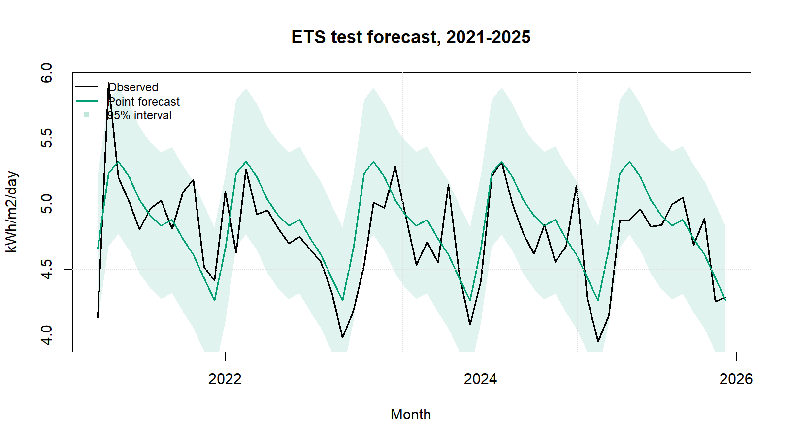
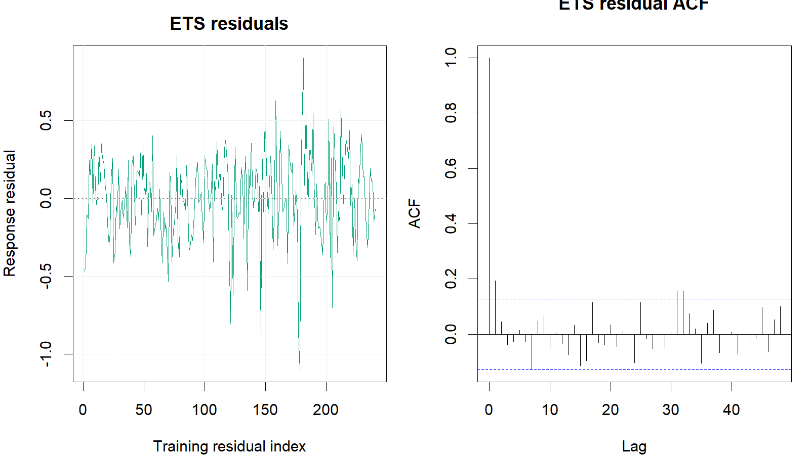

::: {custom-style="Author"}
[Member 3 name]
:::

::: {custom-style="Affiliation"}
[University and faculty]  
BMMS2094 Statistics for Data Science · Student ID: [ID] · Tutorial/Group: [Identifier]  
Assigned model: Error–Trend–Seasonal state-space model · Submission date: [DD Month YYYY]
:::

```{=openxml}
<w:p><w:pPr><w:sectPr><w:type w:val="continuous"/><w:pgSz w:w="12240" w:h="15840"/><w:pgMar w:top="1080" w:right="893" w:bottom="1440" w:left="893" w:header="720" w:footer="720" w:gutter="0"/><w:cols w:num="1" w:space="720"/><w:docGrid w:linePitch="360"/></w:sectPr></w:pPr></w:p>
```

# Methodology

This report proposes evaluating ETS for the monthly Kuala Lumpur NASA POWER irradiance series [@nasa-power-monthly]. ETS identifies the observation error, trend, and seasonal state forms in that order and provides coherent point forecasts and intervals. It generalises classical exponential smoothing by selecting among state-space structures with a likelihood-based criterion [@hyndman-athanasopoulos-2021].

An 80:20 chronological split would use January 2001–December 2020 for training and January 2021–December 2025 for testing; chronological order would prevent future leakage. Transformation would be assessed using training data only, with a common response scale preferred when diagnostics did not require otherwise.

The unrestricted automatic call `ets(train)` would deliberately search the standard ETS error, trend, damping, and seasonal structures rather than impose an unsupported component restriction. Retaining this broad search would be justified by uncertainty about the appropriate state-space form, not merely because it is the software default. The training time plot, decomposition components, and variance evidence would establish plausible forms, while minimum AICc would select among fitted ETS candidates. The selected structure would then have to pass residual and physical-plausibility checks. Component forms would be selected settings; α, β, γ, and φ, when applicable, would be jointly estimated by likelihood rather than manually chosen.

Diagnostics would use response residuals (`observed − fitted`) so that departures remained interpretable on the original response scale rather than as multiplicative innovations [@forecast-residuals]. Residual time plots, ACF, and a lag-24 Ljung–Box test with the applicable fitted degrees of freedom would determine whether a specification loop-back was needed. Training and test performance would be reported consistently using ME, MSE, RMSE, MAE, MPE, and MAPE, together with each test-minus-training difference. ME and MPE would be judged by closeness to zero and sign; the remaining error measures would be minimised.

# Data Analysis (Results and Discussion)

**Training evidence and model identification—**Training-only decomposition indicated pronounced annual seasonality of roughly stable absolute amplitude and comparatively modest trend movement. Stable absolute amplitude supported additive seasonal candidates and retention of the response scale; modest movement made no-trend candidates plausible. This evidence did not select the final form by itself. An unrestricted error–trend–season search was retained so additive and multiplicative errors, absent or present trend, damping, and seasonal forms could compete; minimum training AICc, followed by residual and plausibility gates, was the declared criterion.

The search selected ETS(A,N,A), with additive errors, no trend, and additive seasonality, because it minimised AICc within the searched family (729.156) and remained physically plausible. Additive error and seasonality are also consistent with response-scale variation, while no trend avoids unsupported long-run extrapolation. Maximum-likelihood optimisation fitted α=0.02036 and γ=0.0001005; neither was manually selected. The small α implies slow level updating, and γ near its lower boundary implies that the estimated monthly seasonal states are almost fixed. β and damping φ were not estimated because the selected structure contained no trend. Lag 24 examines two annual cycles and uses two fitted smoothing degrees of freedom; Ljung–Box gave $Q=32.326$, $p=0.072$, so white noise was not rejected, although the near-threshold result and boundary γ warrant constrained-model sensitivity checks.

| Metric | Training | Test | Test − training |
|---|---:|---:|---:|
| ME (kWh/m²/day) | 0.0065 | −0.0847 | −0.0912 |
| MSE ((kWh/m²/day)²) | 0.0760 | 0.0869 | 0.0108 |
| RMSE (kWh/m²/day) | 0.2758 | 0.2947 | 0.0190 |
| MAE (kWh/m²/day) | 0.2141 | 0.2351 | 0.0210 |
| MPE | −0.2058% | −2.0546% | −1.8488 pp |
| MAPE | 4.5392% | 4.9673% | 0.4281 pp |

The lag-24 Ljung–Box p-value was 0.0720. The negative test ME and MPE indicate average overforecasting under the `actual − forecast` convention. Training–test differences are descriptive because fitted residuals and multi-step holdout errors come from different evaluation settings.

{width=3.20in}

ETS achieved test RMSE 0.2947 and MAE 0.2351, while its residual white-noise result remained just above the 5% threshold. Strengths include a transparent selected structure, probabilistic intervals, and stable additive seasonality. Limitations are the near-boundary γ estimate, a residual p-value close to 0.05, limited explanation of automatic selection, and vulnerability to structural change when seasonal states barely update.

# Conclusion

ETS(A,N,A) is suitable for the observed series and test period: RMSE was 0.2947, MAE was 0.2351, and the lag-24 Ljung–Box test did not reject residual white noise. Its AICc-selected additive state-space structure and probabilistic intervals are strengths, but the near-boundary γ and p-value close to 0.05 indicate limited seasonal adaptation and residual uncertainty. Constrained ETS comparisons, rolling-origin evaluation, and Box–Cox sensitivity analysis are therefore recommended. Forecast intervals should accompany planning decisions, and irradiance should not be equated with electricity output.

# References

::: {#refs}
:::

# Appendix

## Appendix A: Reproducible ETS Code

Canonical source: `../NASA_Solar_Irradiance_Forecasting.R`. No random procedure is used.

{width=3.20in}

```r
train <- window(series, end = c(2020, 12))
test  <- window(series, start = c(2021, 1))

ets_fit <- ets(train) # automatic ZZZ search; AICc selection
ets_fc <- forecast(ets_fit, h = length(test), level = c(80, 95))
ets_response_residuals <-
  as.numeric(train) - as.numeric(fitted(ets_fit))
ets_fitdf <- length(intersect(
  names(coef(ets_fit)), c("alpha", "beta", "gamma", "phi")
))
Box.test(ets_response_residuals, lag = 24,
         type = "Ljung-Box", fitdf = ets_fitdf)
metric_row("ETS", ets_fc, test, train)
```
