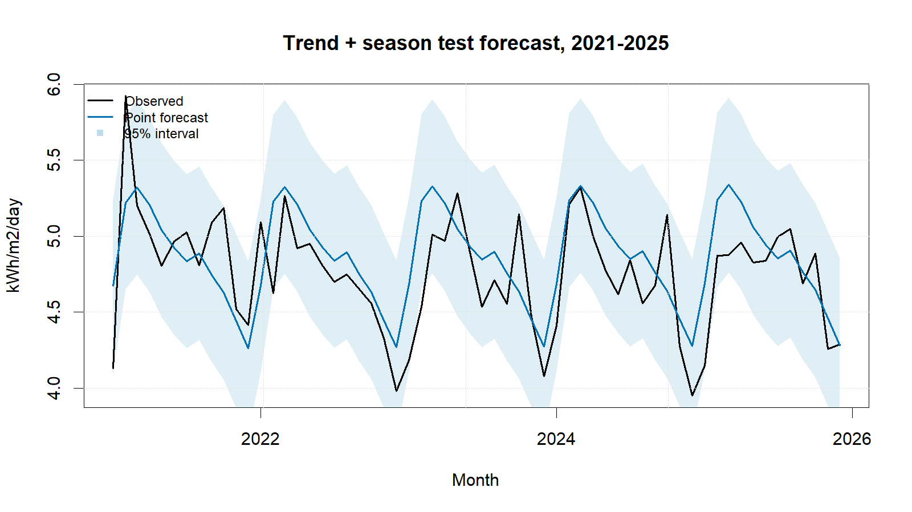
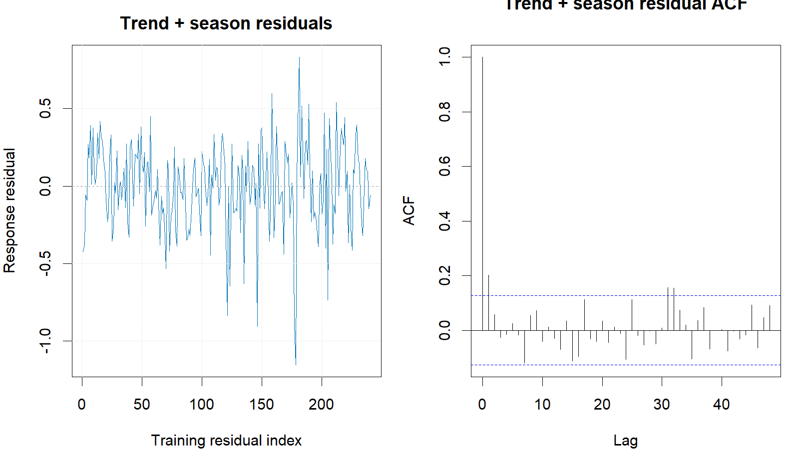

::: {custom-style="Author"}
[Member 4 name]
:::

::: {custom-style="Affiliation"}
[University and faculty]  
BMMS2094 Statistics for Data Science · Student ID: [ID] · Tutorial/Group: [Identifier]  
Assigned model: Multiple linear regression (trend + season) · Submission date: [DD Month YYYY]
:::

```{=openxml}
<w:p><w:pPr><w:sectPr><w:type w:val="continuous"/><w:pgSz w:w="12240" w:h="15840"/><w:pgMar w:top="1080" w:right="893" w:bottom="1440" w:left="893" w:header="720" w:footer="720" w:gutter="0"/><w:cols w:num="1" w:space="720"/><w:docGrid w:linePitch="360"/></w:sectPr></w:pPr></w:p>
```

::: {custom-style="Abstract"}
**Abstract—**This report evaluates a multiple linear regression with deterministic trend and monthly seasonal indicators for NASA POWER surface solar irradiance in Kuala Lumpur. The model achieved test RMSE 0.2988 but failed the lag-24 residual white-noise diagnostic, limiting its suitability as a standalone forecaster.
:::

::: {custom-style="Keywords"}
**Keywords—**forecasting, linear regression, monthly seasonality, solar irradiance, time trend.
:::

# Methodology

This report proposes evaluating multiple linear regression for monthly NASA POWER solar irradiance in Kuala Lumpur [@nasa-power-monthly]. The proposed model is

$$y_t=\beta_0+\beta_1t+\sum_{j=2}^{12}\delta_jD_{j,t}+\varepsilon_t,$$

where $t$ is the numerical month index, January is the reference month, and eleven indicators represent February–December. `forecast::tslm()` creates the `trend` and `season` variables from the time-series attributes [@forecast-tslm]. Simple trend-only regression was excluded because it cannot represent recurring calendar-month effects; the trend term would estimate movement after controlling for month.

The common chronological split would use January 2001–December 2020 for fitting and January 2021–December 2025 for final testing. Both are full annual cycles; random splitting would leak future information. The need for transformation would be assessed from training data only, with response-scale modelling preferred when variance diagnostics did not justify transformation.

The locked formula would be `tslm(train ~ trend + season)`. Ordinary least squares assumes a linear conditional mean, constant error variance, and uncorrelated errors. Coefficients and their uncertainty, adjusted $R^2$, residual standard error, and expanding-window validation at a 12-month horizon would be used to assess explanatory and forecasting performance [@hyndman-athanasopoulos-2021].

Response residuals would be inspected over time and by ACF, followed by a lag-24 Ljung–Box test with fitted regression degrees of freedom [@forecast-checkresiduals]. Material autocorrelation would trigger consideration of regression with ARIMA errors, while the locked assignment model would remain available for the common comparison.

# Results, Discussion, and Conclusion

The fitted model had adjusted $R^2=.5358$ ($R^2=.5591$; residual SE=.2817). Relative to January, the estimated March effect was +0.6468 and the December effect was −0.4147 kWh/m²/day. The trend estimate was +0.000381 per month (SE=0.000263, $p=.148$), so a strong trend was unsupported. Expanding-window validation at $h=12$ used 217 origins and yielded RMSE=.3545 and MAE=.2681. At lag 24 with 13 fitted coefficients, Ljung–Box gave $Q=32.622$, $p<.001$, rejecting residual white noise.

| Test metric | Value |
|---|---:|
| RMSE (kWh/m²/day) | 0.2988 |
| MAE (kWh/m²/day) | 0.2414 |
| MAPE | 5.1093% |
| MASE | 0.8130 |
| sMAPE | 5.0270% |
| Ljung–Box p-value | 0.0006 |

{width=3.20in}

Regression ranked third by RMSE and produced non-negative point forecasts. Its strength is direct interpretation: recurring month effects explain substantial variation, while the small uncertain trend prevents an exaggerated long-run claim. Its main weakness is decisive residual autocorrelation; fixed month effects and a linear trend do not capture remaining temporal dependence. Fixed linear extrapolation and homoscedastic independent-error assumptions are additional limitations.

The specified regression is useful descriptively but is not adequate as the final standalone forecasting model. The strongest extension is regression with ARIMA errors, preserving interpretable trend/month effects while modelling serial correlation. Fourier seasonality, structural-change terms, robust variance checks, and rolling-origin comparisons are also recommended. Any irradiance forecast remains a solar-resource estimate, not photovoltaic electricity output.

::: {custom-style="Heading 5"}
References
:::

::: {#refs}
:::

::: {custom-style="Heading 5"}
Appendix A: Reproducible Regression Code
:::

Canonical source: `../NASA_Solar_Irradiance_Forecasting.R`. No random procedure is used.

{width=3.20in}

```r
train <- window(series, end = c(2020, 12))
test  <- window(series, start = c(2021, 1))

trend_season <- tslm(train ~ trend + season)
reg_fc <- forecast(trend_season, h = length(test), level = c(80, 95))
reg_res <- as.numeric(train) - as.numeric(fitted(trend_season))
Box.test(reg_res, lag = 24, type = "Ljung-Box",
         fitdf = length(coef(trend_season)))

cv_fun <- function(y, h) forecast(tslm(y ~ trend + season), h = h)
cv_h12 <- tsCV(train, cv_fun, h = 12)[, 12]
metric_row("Trend + season", reg_fc, test, train)
```
